<h1 align="center">
  <a>
    
  </a>
  <br>
  RAKT-RADAR
</h1>

<h4 align="center">An AI-powered blood bank management system that provides real-time monitoring, intelligent matching, and emergency response capabilities for healthcare networks across Tamil Nadu.</h4>

<p align="center">
  <a href="#">
    
  </a>
  <a href="#">
    
  </a>
  <a href="#">
    
  </a>
  <a href="#">
    
  </a>
  <a href="#">
    
  </a>
  <br>
  <a href="#">
    
  </a>
  <a href="#">
    
  </a>
  <a href="#">
    
  </a>
  <a href="http://localhost:5173">
    
  </a>
</p>

<p align="center">
  <a href="#key-features">Key Features</a> •
  <a href="#architecture">Architecture</a> •
  <a href="#installation">Installation</a> •
  <a href="#usage">Usage</a> •
  <a href="#ai-capabilities">AI Capabilities</a> •
  <a href="#contributing">Contributing</a>
</p>

## 🎯 **Real-Time Dashboard Overview**

**Comprehensive blood bank management with live monitoring, AI-powered analytics, and emergency response capabilities**


*Live dashboard showing real-time blood inventory, critical alerts, and Tamil Nadu network status*

## 🩸 **Blood Management System**


**Advanced blood unit management with AI monitoring, expiry tracking, and automated inventory control**

*Complete blood unit management system with add, search, and inventory tracking capabilities*

## 🚨 **Emergency Response System**

**AI-powered emergency blood request system with intelligent matching and route optimization**


*Real-time emergency blood request system with AI analysis and network optimization*

## Key Features

* **Real-Time AI Monitoring** - Continuous monitoring of blood inventory every 15-30 seconds
  - Automatic expiry prediction with 7-day advance warnings
  - Live critical alerts for units nearing expiration
  - Real-time network status monitoring across Tamil Nadu
* **Intelligent Blood Matching**
  - AI-powered blood type compatibility analysis
  - Smart demand-supply matching algorithms
  - Proximity-based unit selection for optimal delivery
* **Emergency Response System**
  - Immediate AI analysis for critical blood requests
  - Automatic route optimization using geographic coordinates
  - Real-time transfer coordination between blood banks
* **Comprehensive Blood Management**
  - Add, edit, and delete blood units with full validation
  - Advanced search and filtering capabilities
  - Complete inventory tracking with status monitoring
* **Network Integration**
  - Multi-hospital blood bank network connectivity
  - Tamil Nadu regional network integration
  - Live tracking and coordination between facilities
* **Smart Routing & Optimization**
  - Haversine distance calculations for optimal routes
  - Travel time estimation and path optimization
  - Automated transfer scheduling and coordination
* **Production-Ready Architecture**
  - Scalable multi-page React application
  - RESTful API with full CRUD operations
  - Real-time data synchronization and updates
* **Professional UI/UX**
  - Clean, intuitive interface design
  - Responsive layout for all devices
  - Real-time status indicators and notifications
 
## 🛠️ Technical Stack

| Layer | Technology | Version | Purpose |
|-------|------------|---------|---------|
| **Frontend** | React | 18+ | Modern UI with hooks and functional components |
| **Backend** | Flask | 2.0+ | Lightweight Python web framework for REST API |
| **Database** | SQLite | 3.0+ | Lightweight database for real-time blood inventory |
| **AI Engine** | Python ML | 3.8+ | Natural language processing and prediction algorithms |
| **Routing** | Haversine | Latest | Geographic distance calculations for optimal routes |
| **Real-time** | WebSocket | Latest | Live data synchronization and updates |
| **Deployment** | Local Server | Latest | Development and testing environment |
| **API** | RESTful | Latest | Standardized communication between frontend and backend |

### **Technology Justification**

- **React 18+**: Chosen for its component-based architecture, excellent performance with concurrent features, and vast ecosystem
- **Flask**: Selected for its simplicity, flexibility, and perfect fit for REST API development without unnecessary overhead
- **SQLite**: Opted for its lightweight nature, perfect for development and testing, with easy migration to PostgreSQL for production
- **Python ML**: Essential for AI-powered blood matching, expiry prediction, and route optimization algorithms
- **Haversine Formula**: Critical for calculating real geographic distances between blood banks and hospitals
- **WebSocket**: Enables real-time updates for live monitoring and emergency response coordination
- **RESTful API**: Provides standardized, scalable communication between all system components

## 🏛️ Architecture



```mermaid
graph TB
    subgraph "Frontend Layer"
        A[React Dashboard] --> B[Blood Management]
        A --> C[Emergency Requests]
        A --> D[Live Tracking]
        B --> E[Add/Edit/Delete Units]
        C --> F[AI Analysis]
        D --> G[Route Optimization]
    end
    
    subgraph "API Layer"
        H[Flask REST API] --> I[Blood Unit CRUD]
        H --> J[AI Matching Service]
        H --> K[Route Calculation]
        H --> L[Emergency Response]
    end
    
    subgraph "AI Engine"
        M[Expiry Prediction] --> N[Demand Matching]
        N --> O[Route Optimization]
        O --> P[Emergency Analysis]
    end
    
    subgraph "Data Layer"
        Q[SQLite Database] --> R[Blood Units]
        Q --> S[Hospitals]
        Q --> T[Transfers]
        Q --> U[Emergency Requests]
    end
    
    subgraph "External Services"
        V[Geographic API] --> W[Distance Calculation]
        W --> X[Route Planning]
    end
    
    A --> H
    H --> M
    M --> Q
    H --> V
    
    style A fill:#61DAFB
    style H fill:#000000
    style M fill:#FF6B6B
    style Q fill:#003B57
```

### **System Components**

- **Frontend (React)**: Multi-page application with real-time updates
- **Backend (Flask)**: RESTful API with AI integration
- **AI Engine**: Intelligent matching, routing, and prediction algorithms
- **Database (SQLite)**: Real-time data storage and retrieval
- **External APIs**: Geographic services for route optimization

## 🚀 Installation

### Prerequisites
- Python 3.8+
- Node.js 16+
- pnpm or npm

### Backend Setup

```bash
# Clone the repository
git clone https://github.com/Mithurn/rakt-radar.git
cd rakt-radar

# Navigate to backend
cd rakt_radar_backend

# Create virtual environment
python -m venv venv
source venv/bin/activate  # On Windows: venv\Scripts\activate

# Install dependencies
pip install -r requirements.txt

# Start the backend server
python src/main.py
```

**Backend will run on:** `http://localhost:8000`

### Frontend Setup

```bash
# Navigate to frontend (in a new terminal)
cd rakt-radar-frontend

# Install dependencies
pnpm install

# Start the development server
pnpm run dev --host
```

**Frontend will run on:** `http://localhost:5173`

## 🎯 Usage

### System Access
- **Main Dashboard**: `http://localhost:5173/`
- **Blood Management**: `http://localhost:5173/blood-management`
- **Emergency Requests**: `http://localhost:5173/emergency-requests`
- **Live Tracking**: `http://localhost:5173/live-tracking`

### Key Workflows

#### 1. **Blood Unit Management**
1. Navigate to Blood Management page
2. Add new blood units with type, quantity, and dates
3. AI automatically analyzes for matches and expiry warnings
4. Search and filter existing units
5. Edit or delete units as needed

#### 2. **Emergency Response**
1. Access Emergency Requests page
2. Fill out critical blood request form
3. AI immediately analyzes available units
4. System calculates optimal routes and transfer paths
5. Initiate emergency transfer with one click

#### 3. **Real-Time Monitoring**
1. Dashboard provides live system status
2. Monitor critical alerts and expiry warnings
3. Track network connectivity and performance
4. View real-time inventory and distribution metrics


## 🤝 Contributing

Contributions are welcome! Please feel free to submit a Pull Request.

### Development Setup

```bash
# Clone the repository
git clone https://github.com/Mithurn/rakt-radar.git
cd rakt-radar

# Backend setup
cd rakt_radar_backend
python -m venv venv
source venv/bin/activate
pip install -r requirements.txt

# Frontend setup
cd ../rakt-radar-frontend
pnpm install

# Start both servers
# Terminal 1: Backend
cd rakt_radar_backend && python src/main.py

# Terminal 2: Frontend
cd rakt-radar-frontend && pnpm run dev --host
```

## 🏥 Healthcare Impact

This system addresses critical healthcare challenges:

- ✅ **Reduces Blood Wastage**: AI predicts expiry and optimizes distribution
- ✅ **Improves Emergency Response**: Real-time matching and routing
- ✅ **Enhances Network Efficiency**: Coordinated multi-hospital operations
- ✅ **Saves Lives**: Faster access to critical blood supplies
- ✅ **Scalable Solution**: Ready for deployment across India

## 📄 License

This project is licensed under the MIT License - see the [LICENSE](LICENSE) file for details.

## 👨‍💻 Author & Contact

**Mithurn Jeromme**  
*Full-Stack Developer & AI Healthcare Innovator*

- 🌐 **Website**: [mithurnjeromme.vercel.app](https://mithurnjeromme.vercel.app)
- 💼 **LinkedIn**: [linkedin.com/in/mithurn-jeromme-s-k](https://www.linkedin.com/in/mithurn-jeromme-s-k/)
- 🐙 **GitHub**: [github.com/Mithurn](https://github.com/Mithurn)
- 📧 **Email**: mithurnjeromme172@gmail.com
- 🐦 **Twitter**: [@Mithurn_Jeromme](https://x.com/Mithurn_Jeromme)

---

<div align="center">

**Built with ❤️ to save lives through AI-powered healthcare solutions**

[Report Bug](https://github.com/Mithurn/rakt-radar/issues) • [Request Feature](https://github.com/Mithurn/rakt-radar/issues) • [Documentation](https://github.com/Mithurn/rakt-radar/wiki)

</div>
