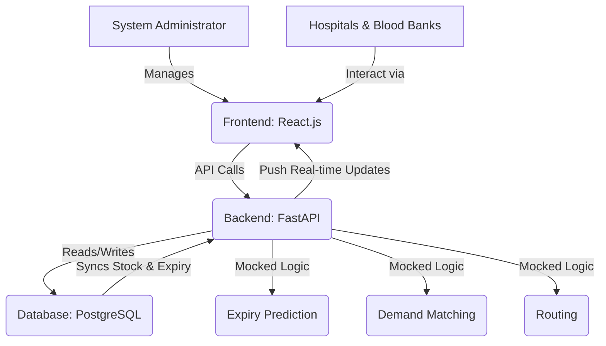

# System Design: RAKT-RADAR MVP

## 2.1 Data Models

To support the core functionalities of RAKT-RADAR, the following data models will be implemented. These models are designed to be straightforward for the MVP, focusing on essential attributes required for tracking, expiry prediction (mocked), and demand matching (mocked).

### 2.1.1 Hospital Model

Represents a hospital entity within the system. Each hospital can have multiple blood units and can be a recipient of blood transfers.

| Field Name    | Data Type | Description                                   | Constraints      |
|---------------|-----------|-----------------------------------------------|------------------|
| `id`          | UUID      | Unique identifier for the hospital            | Primary Key, Auto-generated |
| `name`        | String    | Name of the hospital                          | Not Null, Unique |
| `address`     | String    | Physical address of the hospital              | Not Null         |
| `city`        | String    | City where the hospital is located            | Not Null         |
| `state`       | String    | State where the hospital is located           | Not Null         |
| `latitude`    | Float     | Geographical latitude for proximity calculations | Not Null         |
| `longitude`   | Float     | Geographical longitude for proximity calculations| Not Null         |
| `contact_person`| String  | Name of the primary contact person            | Not Null         |
| `contact_email` | String  | Email of the primary contact person           | Not Null, Unique |
| `contact_phone` | String  | Phone number of the primary contact person    | Not Null         |

### 2.1.2 Blood Bank Model

Represents a blood bank entity. Blood banks are primary sources of blood units and can also receive transfers.

| Field Name    | Data Type | Description                                   | Constraints      |
|---------------|-----------|-----------------------------------------------|------------------|
| `id`          | UUID      | Unique identifier for the blood bank          | Primary Key, Auto-generated |
| `name`        | String    | Name of the blood bank                        | Not Null, Unique |
| `address`     | String    | Physical address of the blood bank            | Not Null         |
| `city`        | String    | City where the blood bank is located          | Not Null         |
| `state`       | String    | State where the blood bank is located         | Not Null         |
| `latitude`    | Float     | Geographical latitude for proximity calculations | Not Null         |
| `longitude`   | Float     | Geographical longitude for proximity calculations| Not Null         |
| `contact_person`| String  | Name of the primary contact person            | Not Null         |
| `contact_email` | String  | Email of the primary contact person           | Not Null, Unique |
| `contact_phone` | String  | Phone number of the primary contact person    | Not Null         |

### 2.1.3 Blood Unit Model

Represents an individual blood unit, tracking its type, quantity, and crucial expiry information. This model is central to the system's inventory management and expiry prediction features.

| Field Name    | Data Type | Description                                   | Constraints      |
|---------------|-----------|-----------------------------------------------|------------------|
| `id`          | UUID      | Unique identifier for the blood unit          | Primary Key, Auto-generated |
| `blood_bank_id` | UUID    | Foreign key referencing the owning blood bank | Not Null, Foreign Key (BloodBank.id) |
| `blood_type`  | String    | Blood type (e.g., 'A+', 'O-', 'AB+')          | Not Null         |
| `quantity_ml` | Integer   | Quantity of blood in milliliters              | Not Null, > 0    |
| `collection_date`| Date   | Date when the blood unit was collected        | Not Null         |
| `expiry_date` | Date      | Date when the blood unit expires              | Not Null         |
| `status`      | String    | Current status (e.g., 'available', 'transferred', 'expired') | Not Null, Default 'available' |
| `is_flagged_for_expiry` | Boolean | True if flagged for nearing expiry (mocked) | Not Null, Default False |
| `current_location_latitude` | Float | Current latitude of the blood unit (for tracking) | Not Null |
| `current_location_longitude` | Float | Current longitude of the blood unit (for tracking) | Not Null |

### 2.1.4 Transfer Model

Represents a record of blood unit transfers between entities. This is crucial for tracking the movement of blood and auditing.

| Field Name    | Data Type | Description                                   | Constraints      |
|---------------|-----------|-----------------------------------------------|------------------|
| `id`          | UUID      | Unique identifier for the transfer            | Primary Key, Auto-generated |
| `blood_unit_id` | UUID    | Foreign key referencing the transferred blood unit | Not Null, Foreign Key (BloodUnit.id) |
| `from_entity_id` | UUID   | ID of the entity transferring the blood (BloodBank or Hospital) | Not Null |
| `to_entity_id` | UUID     | ID of the entity receiving the blood (BloodBank or Hospital) | Not Null |
| `transfer_date` | DateTime | Date and time of the transfer                 | Not Null         |
| `status`      | String    | Status of the transfer (e.g., 'pending', 'completed', 'cancelled') | Not Null, Default 'pending' |
| `notes`       | Text      | Any additional notes about the transfer       | Nullable         |

## 2.2 API Endpoints

The backend API will be built using FastAPI, providing a set of RESTful endpoints to interact with the defined data models and system functionalities. For the MVP, the focus will be on essential CRUD operations and mocked intelligence features.

### 2.2.1 Hospital Endpoints

*   **`POST /hospitals/`**: Register a new hospital.
    *   Request Body: Hospital details (name, address, contact info, lat/long).
    *   Response: Newly created Hospital object.
*   **`GET /hospitals/`**: Retrieve a list of all registered hospitals.
    *   Response: Array of Hospital objects.
*   **`GET /hospitals/{hospital_id}`**: Retrieve details of a specific hospital.
    *   Response: Hospital object.
*   **`PUT /hospitals/{hospital_id}`**: Update details of an existing hospital.
    *   Request Body: Updated Hospital details.
    *   Response: Updated Hospital object.
*   **`DELETE /hospitals/{hospital_id}`**: Delete a hospital record.
    *   Response: Success message.

### 2.2.2 Blood Bank Endpoints

*   **`POST /blood_banks/`**: Register a new blood bank.
    *   Request Body: Blood Bank details (name, address, contact info, lat/long).
    *   Response: Newly created Blood Bank object.
*   **`GET /blood_banks/`**: Retrieve a list of all registered blood banks.
    *   Response: Array of Blood Bank objects.
*   **`GET /blood_banks/{blood_bank_id}`**: Retrieve details of a specific blood bank.
    *   Response: Blood Bank object.
*   **`PUT /blood_banks/{blood_bank_id}`**: Update details of an existing blood bank.
    *   Request Body: Updated Blood Bank details.
    *   Response: Updated Blood Bank object.
*   **`DELETE /blood_banks/{blood_bank_id}`**: Delete a blood bank record.
    *   Response: Success message.

### 2.2.3 Blood Unit Endpoints

*   **`POST /blood_units/`**: Add a new blood unit to inventory.
    *   Request Body: Blood Unit details (blood_bank_id, blood_type, quantity_ml, collection_date, expiry_date, current_location_latitude, current_location_longitude).
    *   Response: Newly created Blood Unit object.
*   **`GET /blood_units/`**: Retrieve a list of all blood units (with optional filters like `status`, `blood_type`, `is_flagged_for_expiry`).
    *   Response: Array of Blood Unit objects.
*   **`GET /blood_units/{blood_unit_id}`**: Retrieve details of a specific blood unit.
    *   Response: Blood Unit object.
*   **`PUT /blood_units/{blood_unit_id}`**: Update details of a blood unit (e.g., status, location).
    *   Request Body: Updated Blood Unit details.
    *   Response: Updated Blood Unit object.
*   **`DELETE /blood_units/{blood_unit_id}`**: Delete a blood unit record.
    *   Response: Success message.

### 2.2.4 Operational Intelligence Endpoints (Mocked for MVP)

*   **`GET /blood_units/flagged_for_expiry`**: Retrieve blood units flagged as nearing expiry.
    *   Response: Array of Blood Unit objects.
*   **`GET /demand_matching/`**: Find potential matches for blood units nearing expiry.
    *   Request Params: `blood_unit_id` (optional, to find matches for a specific unit).
    *   Response: Array of potential matches (e.g., `{'blood_unit_id': '...', 'hospital_id': '...', 'distance_km': '...'}`).
*   **`GET /routing/{from_entity_id}/{to_entity_id}`**: Get a mocked route between two entities.
    *   Response: Mocked route information (e.g., `{'distance_km': '...', 'estimated_time_minutes': '...'}`).

### 2.2.5 Transfer Endpoints

*   **`POST /transfers/`**: Record a new blood unit transfer.
    *   Request Body: Transfer details (blood_unit_id, from_entity_id, to_entity_id, transfer_date, status, notes).
    *   Response: Newly created Transfer object.
*   **`GET /transfers/`**: Retrieve a list of all transfers.
    *   Response: Array of Transfer objects.
*   **`GET /transfers/{transfer_id}`**: Retrieve details of a specific transfer.
    *   Response: Transfer object.
*   **`PUT /transfers/{transfer_id}`**: Update the status or details of a transfer.
    *   Request Body: Updated Transfer details.
    *   Response: Updated Transfer object.

## 2.3 System Architecture

The MVP system architecture will follow a client-server model, with a clear separation between the frontend (React.js) and the backend (FastAPI). PostgreSQL will serve as the primary database.

**Components:**

*   **Frontend (React.js):** A single-page application providing a user interface for hospitals and blood banks to manage their inventory, view flagged units, and see potential matches. It will communicate with the backend via RESTful API calls.
*   **Backend (FastAPI):** A Python-based API server responsible for:
    *   Handling all business logic.
    *   Interacting with the PostgreSQL database.
    *   Implementing mocked logic for expiry prediction, demand matching, and routing.
    *   Exposing RESTful endpoints for the frontend and other potential consumers.
*   **Database (PostgreSQL):** A relational database storing all persistent data, including hospital, blood bank, blood unit, and transfer records.
*   **Mocked Intelligence Modules:** Placeholder functions within the FastAPI application that simulate the behavior of the more complex AI/ML models and external API integrations (Google Maps) for the MVP. These will return predefined or simplified results.

**Data Flow:**

1.  Hospitals and Blood Banks interact with the React.js frontend to input and update blood unit information.
2.  The frontend sends API requests to the FastAPI backend.
3.  The FastAPI backend processes these requests, interacts with the PostgreSQL database for data persistence, and applies mocked intelligence logic.
4.  Data from the database (e.g., updated inventory, flagged units) is pushed back to the frontend for real-time display.
5.  System Administrators can manage entities and oversee the overall system through the frontend.

